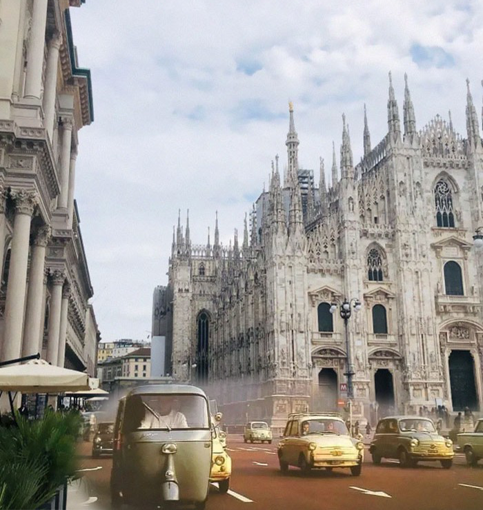

# A look into the past

成员


## 问题描述
### Motivation
如果在同一个地方，不同的时间拍摄一组照片，眼前的视角会有多大变化？人们喜欢做这件事，于是网络上留下了不少这样的对比图像。我们将它们拼到一起，站在现代化世界的一角，就仿佛能看到数十年前的场景就在这里再现。该任务称为"A look into the past"：历历在目。

### Problem Formulation
我们有对比图像若干组，每组都是在同一地点先后相隔很多年拍下的两张图像，比如意大利米兰街头的1920年和2008年。它们虽然大致视角相同，但是存在拍摄姿势、光照、位移的不同，并且部分背景是有大改变的。我们的任务是将旧图像的一部分抠下来，拼接到新图像的正确位置，并且做好像素处理，使得结果既不突兀，又有视觉穿越的观感。  
我们把任务细分成三个步骤，也是三个难点：  
1. 抠图，因为不同图像有不同的拼接需求，我在这里使用手动制作mask抠图。
2. 图像配准，通过照片中有用的信息，如不变的建筑物等，计算得出拼接的中心位置。这本质上是一个像素配准问题，简单的思路是提取特征点并且匹配，得出大致的图像位置平移量。
3. 图像融合，即源图像和目标图像拼接后处理，比如融合风格保持一致，融合边界有视觉效应但不失真。这里我采用的是著名论文《Poisson Image Editing》，即图像编辑之泊松融合算法。


## 原理分析
### image Registration

### image editing: poisson blending


## 代码实现
* 自制mask
* 特征提取并配对，得出偏移量
* 图像融合
* 边界处理

尽量讲清楚自己的设计，以上分析的每个技术难点分别采用什么样的算法实现的，可以是自己写的（会有加分），也可以调包。如有参考别人的实现，虽不可耻，但是要自己理解和消化，可以摆上参考链接，也鼓励大家进行优化和改进。

- 鼓励大家分拆功能，进行封装，减小耦合。每个子函数干的事情尽可能简单纯粹，方便复用和拓展，整个系统功能也简洁容易理解。
- 尽量规范地命名和注释，使代码容易理解，可以自己参考网上教程。

## 工程结构

```text
.
├── code
│   ├── run.py
│   └── utils.py
├── input
│   ├── bar.png
│   └── foo.png
└── output
    └── result.png
```

## 效果展示

在这儿可以展示自己基于素材实现的效果，可以贴图，如果是视频，建议转成 Gif 插入，例如：



如果自己实现了好玩儿的 feature，比如有意思的交互式编辑等，可以想办法展示和凸显出来。


## 运行说明

在这里，建议写明依赖环境和库的具体版本号，如果是 python 可以建一个 requirements.txt，例如：

```
opencv-python==3.4
Flask==0.11.1
```

运行说明尽量列举清晰，例如：
```
pip install opencv-python
python run.py --src_path xxx.png --dst_path yyy.png
npm run make-es5 --silent
```

