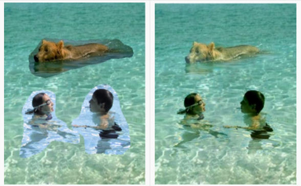
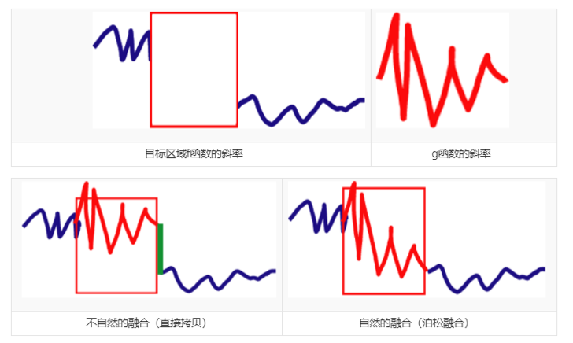
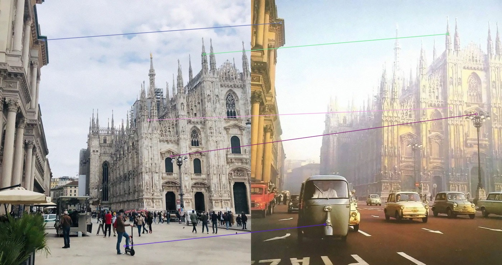
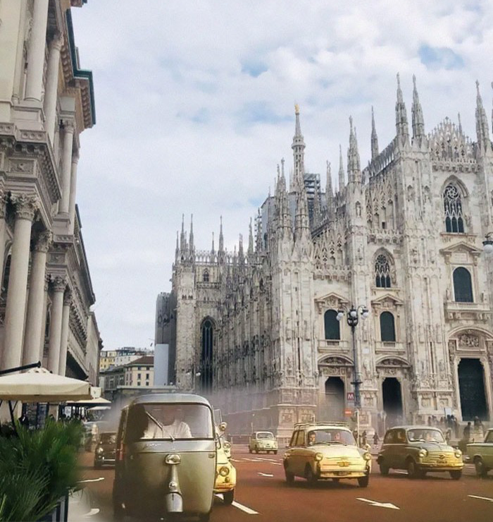

# A look into the past

> 成员 PB18000363 Peng Ziwei  
> 负责调研任务场景、调研论文算法、学习所用库、综合程序实现

## 问题描述
### Motivation
如果在同一个地方，不同的时间拍摄一组照片，眼前所见会有多大变化？人们很乐意做这件事，于是在网络上留下了不少这样的对比图像。我们将它们拼到一起，站在现代化世界的一角，就仿佛能看到数十年前的场景就在这里再现。该任务称为"A look into the past"：历历在目。

### Problem Formulation
我们有对比图像若干组，每组都是在同一地点先后相隔很多年拍下的两张图像，比如意大利米兰街头的1920年和2008年。
它们虽然大致视角相同，但是存在拍摄姿势、光照、位移的不同，并且部分背景是有大改变的。我们的任务是将旧图像的一部分抠下来，拼接到新图像的正确位置，并且做好像素处理，使得结果既不突兀，又有视觉穿越的观感。 

我们把任务细分成三个步骤，也是三个难点：  
1. 抠图，因为不同图像有不同的拼接需求，我在这里使用手动制作mask抠图。
2. 图像配准，通过照片中有用的信息，如不变的建筑物等，计算得出拼接的中心位置。这本质上是一个像素配准问题，简单的思路是提取特征点并且匹配，得出大致的图像位置平移量。
3. 图像融合，即源图像和目标图像拼接后处理，比如融合风格保持一致，融合边界有视觉效应但不失真。这里我采用的是著名论文《Poisson Image Editing》[3]，即图像编辑泊松融合算法。

## 原理分析
### image Registration
图像配准，有很多研究方法和广泛应用场景，包括双目视觉匹配、全景图像连接等等。
这里我们对准像素主要是为了确定融合图像放置的中心位置，也就是求解一个位移(px,py)，不需要精准对应和合并。所以，我采用特征提取并且匹配像素，将索引位置相减得到位移的简单方法。
* 图像特征提取，有Harris、SIFT等经典方法，也有AKAZE、ORB、RANSAC等先进算法。要求不是很高的话，我们这里调用opencv中的特征提取器，便能得到特征点。
* 图像像素匹配，我们采用最近邻思想：只要特征点近邻匹配对的距离小于一定标准，那么该对匹配成功。
* 我们的匹配取决于提取像素中是否存在真正的相关性。如果我们匹配参数设置严格一点只得到几组像素，那么求差平均即可；如果得到了大量匹配对，可能需要筛选特征点以及正确的配对结果。

### image editing: poisson blending
图像融合，就是把不同的图像的不同部分放在一起，形成一张新的图像。融合得越自然，算法就越好。最简单的算法就是α-blending，即融合边界把两张图像的透明度线性相加，形成一张新的图像。稍复杂一点的laplacian blending算法是考虑多分辨率，利用高斯金字塔和拉普拉斯金字塔，在每一层都进行一次α-blending，从而达到各个频率完全融合的效果。

但是大部分情况下融合出的结果并不理想。这在我们的任务设定中更为明显，因为历史图像和新图像有相同的信息，也有不同的信息，差异体现在局部图像块，无法通过整体频率信息融合。

2003年提出的Poisson Blending[1,3]从图像梯度出发，目标是历史图像的梯度信息保留并迁移到新图像的指定区域中，而非全部的频率信息或者透明度信息迁移。
图像的梯度，也就是一维的斜率，某种意义上刻画了像素变化的速度。泊松融合的思想并不是让像素叠加，而是让目标图像在融合部分按照源图像的变化规律“衍生”出来。也就是说，只提供源图像的斜率，让目标图像根据自己图像的特点，按照对应斜率生成融合部分。由于并没有添加外来的元素，生成的图片更加自然。

在泊松融合中，我们考虑如下数学问题：
$$\text{min}_f\iint_{\Omega} |\nabla f-\mathbf v|^2  \qquad \text{with}\;\; f|_{\partial \Omega}=f^*|_{\partial \Omega}  $$

如果要把图像B融合在图像A上，f表示想要融合出的结果图像C，f*表示目标图像A，v表示源图像B的梯度，▽f表示f的一阶梯度，$\Omega$表示要融合的区域，$\partial \Omega$ 代表融合区域的边缘部分。

通过数学优化理论，我们将方程转化为：
$$\Delta f = \textbf{div}\, \mathbf{v} \;\text{over}\; \Omega, \,\,  \text{with}\; f|_{\partial \Omega}=f^*|_{\partial \Omega} $$
对于离散形式的像素而言，这里$\textbf{div}\, \mathbf{v}_{ij}\;$即源图像像素$v_{ij}$的二阶导，于是我们求解的是：
$$\sum_{q\in \Omega} f_q - 4f_p= \sum_{q\in\Omega \cup \partial \Omega}\Delta B_q  \qquad这里p=(x,y), q=(x+dx,y+dy)\in N_p$$ 
为了满足边界条件，即像素$p=(x,y)$属于边界的情况，我们只需要把系数4改成其领域像素位于区域边界和内部的个数，把$f_q$改成目标图像像素值$A_q$即可。方程右边，我们采用拉普拉斯算子得到源图像像素$B_q$的二阶导数。

## 代码实现
* 自制mask  
这涉及旧照片中感兴趣区域（ROI）的提取。计算机视觉研究中可以对比两张图像找到差异大的区域，从而确定是需要融合的ROI区域。这一点很容易想到，但是实现略复杂，故我们不自动识别ROI区域。  
与之替代的是Adobe® Photoshop 2020®，我们手工绘制mask二值图像，大小和历史图像相等，即环绕ROI区域一圈抠图，里面的区域置为白色表示为待融合部分。图像参考"input/$mask.jpg"。  
如果有能力和时间，希望之后可以实现人机交互式识别ROI区域，也即交互抠图。

* 特征提取并配对，得出偏移量  
这一步由`positioning.py`完成，主要是调用opencv库函数提取特征并且匹配。  
提取特征有很多已有方法，这里采用AKAZE特征提取器。  
下一步由opencv的穷举匹配器`BFmatcher`和近邻算法找到匹配成功像素对。
最难的一点是如何正确计算出偏移量。两张图像有相同的部分，也有不同的部分，匹配结果常常有许多不如人意。考虑到拍摄视角变化不是太大，为了尽可能满足多组图像处理目标而减少人工调参，我们取各个像素对坐标中偏移最少的作为结果。这也就是说我们认为匹配像素应该尽可能在图像位置上相近。这种简单以偏概全的方法不可避免有漏洞，但是在实验的三组图像中，能够实现无人工处理，减少了他人使用时的负担。

* 图像融合  
Poisson Blending算法已经在opencv的seamlessclone函数中实现。**但是我们的两组图像大小相等，融合部分是通过mask提取，而seamlessclone函数要求源图尺寸必须小于目标图像**，所以我们参考[https://github.com/yskmt/pb]  。在这里我简单介绍计算过程，其实现具体参考文件`blending.py`。  
由之前所述原理部分，我们得到源图像二阶导数矩阵`b`并且排成一维形式$[ b_{11}, b_{21}, ...]$。这一步由函数`get_gradient_sum`完成。所要求的像素同样排成一维形式$\textbf f$。  
方程实际上是一个多元线性方程组$\textbf{Af = b}$。利用科学计算包的求解稀疏矩阵方程函数`f=scipy.sparse.linalg.spsolve(A, b)`即可。当然，边界上方程会略有不同。  
$$\begin{bmatrix}
-4&1&   &     &  &\\
1&-4& 1 &  &  &   \\
 & 1&-4 & 1&  &  \\
 &   &1 &-4&1 &  \\
 &   &  &  & ...\end{bmatrix}\begin{bmatrix}f_{11}\\
 f_{21}\\
 f_{31}\\
 f_{41}\\
 ...
 \end{bmatrix} =\begin{bmatrix}b_{11}\\
 b_{21}\\
 b_{31}\\
 b_{41}\\

 ...
 \end{bmatrix}  $$

* 边界处理
我们想要将边界羽化，营造出时间穿越的朦胧效果。因为是对部分像素操作，我们利用mask图像，通过膨胀和腐蚀取得边界带状mask，对这一部分图像进行亮度增强。如果能够只对图像部分滤波的话，效果会更好。
该操作在主函数作为最后一步执行。

## 工程结构

```text
.
│─── blending.py
│─── positioning.py
│─── main.py
|——— show
|   └── ...       // 任务及原理展示图像，与程序运行无关
|
├── input
│   ├── 1src.jpg  //1号旧图像，待移植融合
│   ├── 1dst.jpg  //1号现图像
│   └── 1mask.jpg //三张图像大小相同
└── output
    ├── 1.jpg
    └── 2.jpg
```

## 效果展示



## 运行说明

Python语言实现代码依赖环境和库的具体版本号如下，即使不一致大多数情况下也是支持运行的。
```
Python>=3.6
opencv-python==4.5.1
numpy==1.19.5
scipy==1.4.1
```
使用时直接运行`main.py`，必要时可修改程序中的三张图像路径参数`mask_path`, `src_path`, `dst_path`。

## 总结
本实验完成了历史图像融合的基本任务，结合了经典的计算机视觉算法，能够达成较好的效果。  
但是工作还存在一些不足，例如像素强行配对，对准位置偏差，边缘羽化效果不明显等等。这些待解决的难点，今后有希望通过更深入调研和更先进技术应用来解决，可行条件下引入人机交互执行抠图和配准调整，从而能够进一步出色地实现图像融合任务。

## 参考资料

[1] 计算机视觉：泊松融合 https://drustz.com/posts/2015/10/17/poisson/  
[2] https://github.com/yskmt/pb  
[3] Patrick Pérez, Michel Gangnet, and Andrew Blake. 2003. Poisson image editing. In <i>ACM SIGGRAPH 2003 Papers</i> (<i>SIGGRAPH '03</i>). Association for Computing Machinery, New York, NY, USA, 313–318.